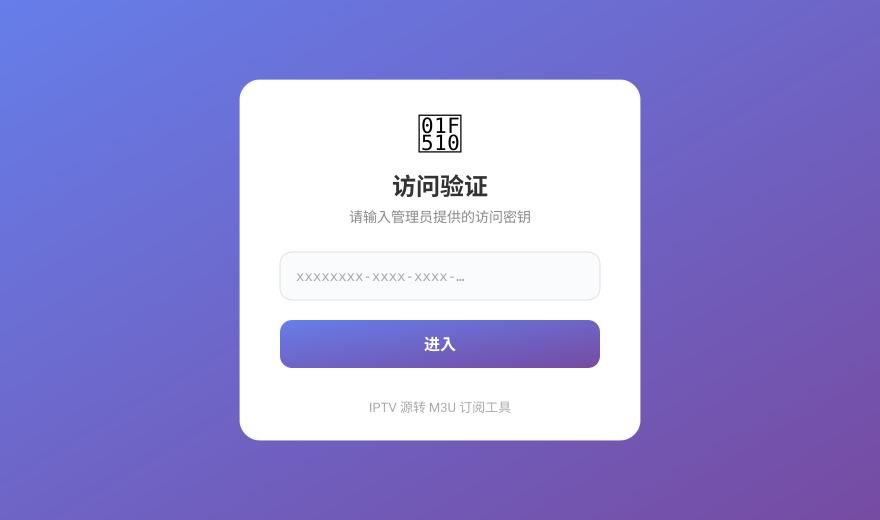
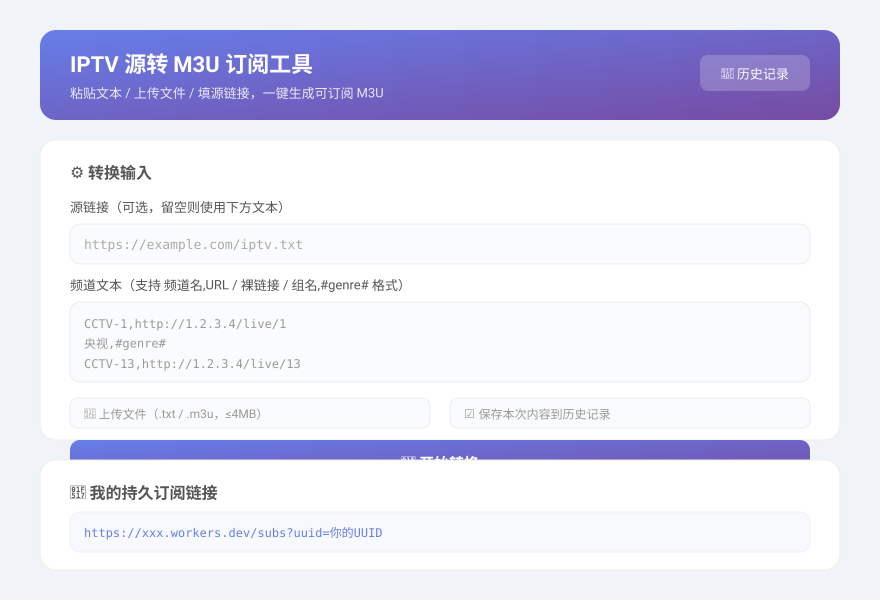
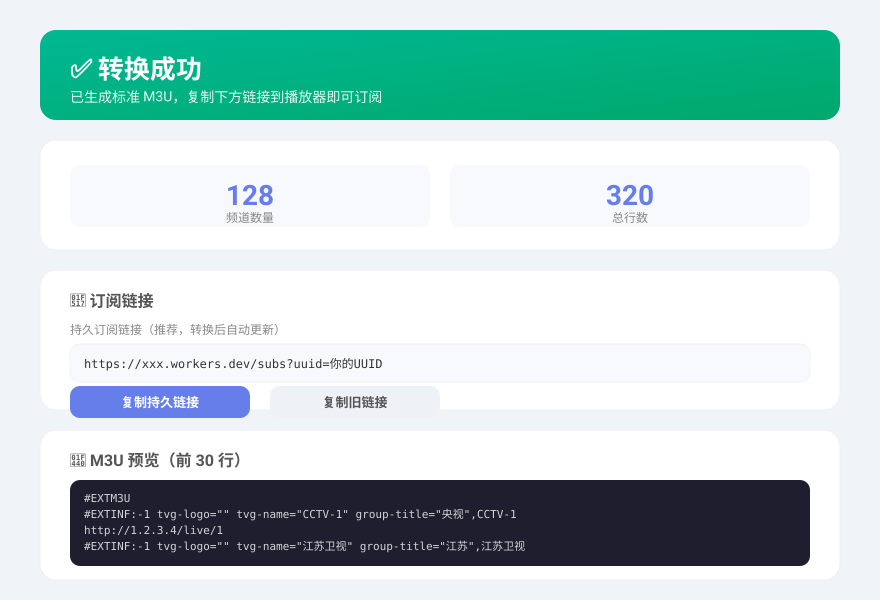

# 📡 IPTV 源转 M3U 订阅工具

[](https://workers.cloudflare.com/)
[](https://developer.mozilla.org/docs/Web/JavaScript)
[](https://developers.cloudflare.com/kv/)
[](LICENSE)

一个部署在 **Cloudflare Workers** 上的轻量工具：把各种杂乱格式的 IPTV 文本源，一键转换成标准 `.m3u` 订阅链接，直接填进 IPTV 播放器（TiviMate、PotPlayer、IPTV Smarters、VLC 等）即可自动更新。

> 纯边缘函数转换 + KV 存储，无服务器、无数据库。Cloudflare 免费额度足够个人 / 小团队长期使用。

---

## ✨ 功能特性

- 🔄 **多格式兼容**：`频道名,URL`、整行裸链接、`组名,#genre#` 分组格式、HTML `<pre>` 包裹的源、以及已经是标准 M3U 的内容（原样返回）。
- 🗂️ **保留源站分组**：自动解析 `#genre#` 分组行，按源站自带分组归类，而非瞎猜省份。
- 🔗 **稳定订阅链接**：转换后生成持久订阅地址，播放器填一次即可，后续转换自动更新。
- ☁️ **源链接自动抓取**：只填一个 URL 也能用，Worker 自动拉取并清洗（带 12s 超时保护）。
- 📜 **历史记录**：可保存每次转换内容，支持单条删除 / 一键清空。
- 🛡️ **安全兜底**：频道名 / 分组名自动转义（去引号、逗号转全角），避免破坏 M3U 属性；认证页防 XSS；M3U 输出带 CORS 头。
- 📱 **响应式页面**：手机 / 电脑均可操作，复制按钮一键带走订阅链接。

---

## 📺 支持的输入格式

| 格式 | 示例 | 说明 |
| --- | --- | --- |
| 频道名 + URL | `CCTV-1,http://1.2.3.4/live/1` | 逗号 / 全角逗号 / `$` / 空格 均可作分隔 |
| 分组 + 频道 | `央视,#genre#`<br>`CCTV-1,http://1.2.3.4/live/1` | 分组行后所有频道归入该组 |
| 裸链接 | `http://1.2.3.4/live/99` | 整行就是一个 URL，归入「未分类」 |
| HTML 包裹 | `<pre>频道,URL…</pre>` | 自动抽离 `<pre>` 或去标签 |
| 已是 M3U | `#EXTM3U` 开头的内容 | 原样返回，不做二次处理 |

支持的协议：`http` / `https` / `rtsp` / `rtp` / `mms`

---

## 🚀 部署步骤

1. 打开 [Cloudflare Dashboard](https://dash.cloudflare.com/) → **Workers & Pages** → 创建 Worker。
2. 进入 **KV**（存储）→ 新建命名空间，记下设好的变量名（例如 `IPTV_KV`）。
3. 在 Worker 的 **设置 → 变量 → KV 命名空间绑定** 中，把命名空间绑定到变量名 `IPTV_KV`。
4. 同样在 **变量 → 环境变量** 中设置：
   - `UUID`：你的管理员密钥（建议用 UUID 生成器生成，例如 `https://www.uuidgenerator.net/`）。
5. 把本仓库的 `IPTV 源转 M3U.js` 内容粘贴进 Worker 编辑器，点击 **部署**。
6. 访问 `https://你的子域.workers.dev/?uuid=你的UUID` 即可使用。

> 💡 `SUB_PASSWORD` 为可选项，默认 `subs`。若设为 `mysecret`，则公开订阅地址变为 `/mysecret`。

---

## ⚙️ 配置变量

| 变量名 | 必填 | 默认值 | 说明 |
| --- | --- | --- | --- |
| `UUID` | ✅ | — | 管理员访问密钥，同时作为各用户数据的隔离标识 |
| `SUB_PASSWORD` | ❌ | `subs` | 公开订阅路径名，例如设为 `mysecret` → 订阅地址 `/mysecret` |
| `IPTV_KV` | ✅ | — | KV 命名空间绑定，用于存储 M3U / 历史记录 |

---

## 🔗 路由说明

| 路径 | 说明 | 是否需要 UUID |
| --- | --- | --- |
| `/` 或 `/?uuid=` | 管理首页（转换 / 历史） | ✅ |
| `/{SUB_PASSWORD}` 或 `/{SUB_PASSWORD}?uuid=` | 公开 M3U 订阅（给播放器用） | ❌（可带 `?uuid=` 指定用户） |
| `/sub?uuid=` | 兼容旧链接 | ✅ |
| `/history?uuid=` | 历史记录列表 | ✅ |
| `/delete-history?id=&uuid=` | 删除单条历史 | ✅ |
| `/clear-history?uuid=` | 清空全部历史 | ✅ |

---

## 📤 输出示例

转换后得到的 `.m3u`（片段）：

```m3u
#EXTM3U
# Generated from TXT/M3U input
# 时间: 2026/7/29 14:22:47
#EXTINF:-1 tvg-logo="" tvg-name="CCTV-1" group-title="央视",CCTV-1
http://1.2.3.4/live/1
#EXTINF:-1 tvg-logo="" tvg-name="江苏卫视" group-title="江苏",江苏卫视
http://1.2.3.4/live/js
```

---

## 🖼️ 页面预览

> 以下为界面示意（SVG  mockup）。

### 访问验证


### 管理首页（转换输入）


### 转换结果


---

## ❓ 常见问题

**Q：多人能用同一个 Worker 吗？**
A：可以。每人用自己的 `UUID` 访问 `/?uuid=自己的UUID`，数据互相隔离。公开订阅链接建议带 `?uuid=自己的UUID`，这样播放器拿到的是**自己**的列表（不带则默认返回站长的列表）。

**Q：播放器提示源无效 / 拉不到？**
A：确认公开订阅地址填的是 `/{SUB_PASSWORD}?uuid=...` 或全部链接 `/sub?uuid=...`；并检查 Worker 是否已成功转换过（首次访问会提示「尚未转换过任何订阅」）。

**Q：源链接抓取失败？**
A：上游可能限制了 UA / Referer，或返回内容过短。可改为手动复制文本粘贴，或把源文件下载后走「上传文件」方式。

**Q：历史记录太多会不会卡？**
A：历史展示上限 500 条；「清空全部」会完整删除所有记录，不影响当前订阅。

---

## 📄 License

[MIT](LICENSE) © 2026
